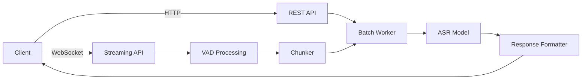

# Parakeet-TDT 0.6B v2 FastAPI STT Service

A production-ready FastAPI service for high-accuracy English speech-to-text using NVIDIA's Parakeet-TDT 0.6B v2 model. Implements both REST and WebSocket endpoints following the [OpenAI Audio API specification](https://platform.openai.com/docs/api-reference/audio) interface.

## Changes from Upstream

This fork includes several improvements to the WebSocket streaming pipeline:

- **In-memory audio pipeline** - VAD chunks are passed as numpy arrays with unique IDs instead of writing temporary WAV files to disk. Eliminates filesystem I/O during streaming.
- **Per-session result isolation** - Each WebSocket session tracks its own chunk IDs, preventing cross-session result leakage under concurrent load.
- **Thread-pooled inference** - ASR inference runs via `asyncio.to_thread()` so the event loop stays responsive during GPU work.
- **Word-level confidence scores** - NeMo's `return_hypotheses=True` and confidence decoding are enabled. WebSocket responses now include `confidence` and per-word `words` scores alongside `text`.
- **Configurable batch window** - New `BATCH_WINDOW_MS` env var (default 100ms) controls how long the micro-batcher waits to collect items before running inference. `BATCH_SIZE` default raised from 4 to 16.
- **Graceful session teardown** - Consumer tasks are properly cancelled and pending results are cleaned up when a WebSocket disconnects.

## Features

- **RESTful transcription**
  - `POST /transcribe` with multipart audio uploads
  - Word/character/segment timestamps
  - OpenAI-compatible response schema

- **WebSocket streaming**
  - Real-time voice activity detection via Silero VAD
  - Partial/final transcription delivery with confidence scores
  - Supports 16kHz mono PCM input
  - Per-session result isolation for safe concurrent use

- **Batch processing**
  - Micro-batching for efficient GPU utilization
  - Configurable batch size and batch window
  - Thread-pooled inference keeps the event loop responsive

- **Production-ready deployment**
  - Docker and Docker Compose support
  - Health checks and configuration endpoints
  - Environment variable configuration

- **Audio preprocessing**
  - Automatic downmixing and resampling
  - File validation and chunking

## Table of Contents

- [Prerequisites](#prerequisites)
- [Installation](#installation)
- [Configuration](#configuration)
- [Running the Server](#running-the-server)
- [Usage](#usage)
  - [REST API](#rest-api)
  - [WebSocket Streaming](#websocket-streaming)
- [Benchmarking](#benchmarking)
- [Architecture Overview](#architecture-overview)
- [Environment Variables](#environment-variables)
- [Contributing](#contributing)

## Prerequisites

- Python 3.10+
- NVIDIA GPU with CUDA 12.1+ (recommended)
- Docker Engine 24.0+ (for container deployment)

## Installation

### Local Development
```bash
git clone https://github.com/your-repo/parakeet-fastapi.git
cd parakeet-fastapi

# Create and activate virtual environment
python -m venv .venv
source .venv/bin/activate

# Install dependencies
pip install -r requirements.txt
```

### Docker Deployment
```bash
docker build -t parakeet-stt .
docker run -d -p 8000:8000 --gpus all parakeet-stt
```

### Docker Compose
```bash
docker-compose up --build
```

## Configuration

All configuration is managed through environment variables. Create a `.env` file with your preferences:

```ini
# Model configuration
MODEL_PRECISION=fp16
DEVICE=cuda
BATCH_SIZE=16
BATCH_WINDOW_MS=100

# Audio processing
TARGET_SAMPLE_RATE=16000
MAX_AUDIO_DURATION=30
VAD_THRESHOLD=0.5

# System
LOG_LEVEL=INFO
PROCESSING_TIMEOUT=60
```

## Running the Server

### Local Development
```bash
uvicorn parakeet_service.main:app --host 0.0.0.0 --port 8000
```

### Production
```bash
docker-compose up --build -d
```

## Usage

### REST API

#### Health Check
```bash
curl http://localhost:8000/healthz
# {"status":"ok"}
```

#### Transcription
```bash
curl -X POST http://localhost:8000/transcribe \
  -F file="@audio.wav" \
  -F include_timestamps=true \
  -F should_chunk=true
```

**Parameters**:
| Name | Type | Default | Description |
|------|------|---------|-------------|
| `file` | `audio/*` | Required | Audio file (wav, mp3, flac) |
| `include_timestamps` | bool | false | Return word/segment timestamps |
| `should_chunk` | bool | true | Enable audio chunking for long files |

**Response**:
```json
{
  "text": "Transcribed text content",
  "timestamps": {
    "words": [
      {"text": "Hello", "start": 0.2, "end": 0.5},
      {"text": "world", "start": 0.6, "end": 0.9}
    ],
    "segments": [
      {"text": "Hello world", "start": 0.2, "end": 0.9}
    ]
  }
}
```

### WebSocket Streaming

Connect to `ws://localhost:8000/ws` to stream audio:

- **Input**: 16kHz mono PCM frames (int16)
- **Output**: JSON messages with transcriptions and confidence scores

**Response format**:
```json
{"text": "hello world", "confidence": 0.9812, "words": [0.9934, 0.9691]}
```

**JavaScript Example**:
```javascript
const ws = new WebSocket("ws://localhost:8000/ws");
const audioContext = new AudioContext();
const processor = audioContext.createScriptProcessor(1024, 1, 1);

processor.onaudioprocess = e => {
  const pcmData = e.inputBuffer.getChannelData(0);
  const int16Data = convertFloat32ToInt16(pcmData);
  ws.send(int16Data);
};

ws.onmessage = evt => {
  const data = JSON.parse(evt.data);
  console.log("Transcription:", data.text);
  console.log("Confidence:", data.confidence);
};
```

## Benchmarking

`benchmark_stt.py` is a realtime streaming concurrency benchmark for the STT service. It generates test audio via a TTS service, streams it over concurrent WebSocket connections at real-time pace, and measures EOS latency, word error rate (WER), GPU utilization, and VRAM usage as concurrency scales up.

### Prerequisites

All benchmark dependencies are included in `requirements.txt`:

```bash
pip install -r requirements.txt
```

You also need:
- A running **STT service** (this project) accessible via WebSocket
- A running **TTS service** (e.g. Chatterbox) to generate test audio on first run
- `nvidia-smi` on the benchmark host for GPU metrics (skipped gracefully if unavailable)

Generated audio is cached locally in `.benchmark_cache/` so the TTS service is only needed on the first run.

### Examples

```bash
# Diagnose connectivity — single verbose session showing every WebSocket message
python benchmark_stt.py --probe --stt-url ws://localhost:8000/ws

# Default benchmark — ramp concurrency 1 -> 5 -> 10 -> 20 -> 30 -> 40
python benchmark_stt.py --stt-url ws://localhost:8000/ws

# Custom concurrency levels with a specific TTS service and output file
python benchmark_stt.py \
  --stt-url ws://localhost:8000/ws \
  --tts-url http://localhost:8004/tts \
  --concurrency 1,10,20,50 \
  --output results.csv

# Verbose mode — print per-session send/receive details for every session
python benchmark_stt.py --stt-url ws://localhost:8000/ws --concurrency 1,5 -v

# Target a specific GPU for monitoring (instead of auto-detect)
python benchmark_stt.py --stt-url ws://localhost:8000/ws --gpu-id 3

# Stress test at high concurrency
python benchmark_stt.py \
  --stt-url ws://localhost:8000/ws \
  --concurrency 1,20,40,60,80,100
```

### Options

| Flag | Default | Description |
|------|---------|-------------|
| `--stt-url` | `ws://localhost:8000/ws` | WebSocket URL of the STT service |
| `--tts-url` | `http://localhost:8004/tts` | HTTP URL of the TTS service for generating test audio |
| `--concurrency` | `1,5,10,20,30,40` | Comma-separated concurrency levels to ramp through |
| `--output` | `benchmark_results.csv` | Output CSV file path |
| `--timeout` | `30.0` | Per-message receive timeout (seconds). Acts as a fallback; the receiver normally exits early once all results are in |
| `--post-wait` | `30.0` | Hard cap on how long to wait after all audio is sent (seconds) |
| `--gpu-id` | auto-detected | GPU device index for monitoring. Auto-detected from the process running the STT model |
| `--probe` | off | Run a single verbose diagnostic session, then exit |
| `--verbose`, `-v` | off | Print per-session frame/message details and timings during the benchmark |

### How It Works

1. **Audio generation** — The tool generates unique TTS audio for each concurrent session from a pool of reference paragraphs. Audio is cached in `.benchmark_cache/` as `.npz` files so subsequent runs skip TTS entirely.

2. **Real-time streaming** — Each session opens a WebSocket, streams 100ms PCM frames at wall-clock pace (simulating a live microphone), then sends 1 second of silence to flush the server's VAD.

3. **Smart early exit** — The receiver tracks `{"status": "queued"}` messages from the server (one per VAD chunk) and counts text results as they arrive. Once all audio has been sent and every queued chunk has a corresponding result, the session exits immediately instead of waiting for the full `--timeout` period.

4. **Word error rate** — Since audio is generated from known reference text, the tool computes WER by comparing the STT transcript against the original. An order-independent matching algorithm handles cases where batched inference returns chunks out of order.

5. **GPU monitoring** — `nvidia-smi dmon` runs in the background sampling utilization and VRAM at 1Hz. The benchmark auto-detects which GPU is running the parakeet process.

### Reported Metrics

| Metric | Description |
|--------|-------------|
| EOS Latency (p50/p95/mean) | Time from last audio frame sent to final transcript received. This is what a voice agent user feels as "waiting for the system to understand." |
| Audio Duration | Average length of the test speech clips (seconds) |
| WER% | Word error rate vs. the known reference text. Requires `jiwer` (`pip install jiwer`). Shows `n/a` if the library is missing |
| GPU% (p95/mean) | GPU SM utilization during the concurrency level (sampled at 1Hz) |
| VRAM (peak/mean) | GPU memory usage in MiB during the concurrency level |
| Fail | Number of sessions that received no transcription vs. total sessions |

### Sample Output

```
Conc   EOS p50  EOS p95  EOS mean  Audio Dur    WER%    Fail  GPU%p95 GPU%mean  VRAM peak VRAM mean
   1    0.2820   0.2820    0.2820      7.44s   0.00%     0/1       0%       0%   5169 MiB  5169 MiB
   5    0.3533   0.6436    0.4238      7.50s   1.95%     0/5      20%       4%   5169 MiB  5169 MiB
  10    0.4123   0.7799    0.4483      7.66s   2.85%    0/10      31%       7%   5169 MiB  5169 MiB
```

### Probe Mode

Use `--probe` for a single verbose session that prints every WebSocket message with timestamps. Useful for diagnosing connectivity issues, checking that the STT service returns results, and verifying VAD flush behavior.

```
$ python benchmark_stt.py --probe --stt-url ws://localhost:8000/ws

  Connecting to ws://localhost:8000/ws ...
  Connected. Streaming at realtime pace (wall-clock paced)...
  [  4.006s] #1 [status]: {'status': 'queued'}
  [  4.303s] #2 [TEXT]:   {'text': 'The quick brown fox jumps over the lazy dog...'}
  [  7.501s] Audio sent. Sending silence to flush VAD...
  [  7.506s] #3 [status]: {'status': 'queued'}
  [  7.780s] #4 [TEXT]:   {'text': 'She sells seashells by the seashore...'}
  [  8.501s] Silence sent. Waiting for results...
  [  8.501s] all 2 result(s) received — exiting early

  Probe complete in 8.50s. Messages received: 4
```

## Architecture Overview



**Components**:
1. **`main.py`** - App initialization and lifecycle management
2. **`routes.py`** - REST endpoints implementation
3. **`stream_routes.py`** - WebSocket endpoint handler with per-session isolation
4. **`streaming_vad.py`** - Voice activity detection (in-memory numpy pipeline)
5. **`chunker.py`** - Audio segmentation
6. **`batchworker.py`** - Micro-batch processing with thread-pooled inference
7. **`model.py`** - ASR model interface with confidence scoring
8. **`audio.py`** - Audio preprocessing utilities
9. **`config.py`** - Configuration management

## Environment Variables

| Variable | Default | Description |
|----------|---------|-------------|
| `MODEL_PRECISION` | fp16 | Model precision (fp16/fp32) |
| `DEVICE` | cuda | Computation device |
| `BATCH_SIZE` | 16 | Processing batch size |
| `BATCH_WINDOW_MS` | 100 | Micro-batch collection window in milliseconds |
| `TARGET_SAMPLE_RATE` | 16000 | Target sample rate |
| `MAX_AUDIO_DURATION` | 30 | Max audio length in seconds |
| `VAD_THRESHOLD` | 0.5 | Voice activity threshold |
| `LOG_LEVEL` | INFO | Logging verbosity |
| `PROCESSING_TIMEOUT` | 60 | Processing timeout in seconds |

## Contributing

1. Fork the repository and create your feature branch
2. Submit a pull request with detailed description
