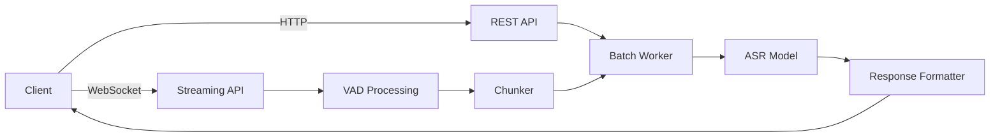

# Parakeet-TDT 0.6B v2 FastAPI STT Service

A production-ready FastAPI service for high-accuracy English speech-to-text using NVIDIA's Parakeet-TDT 0.6B v2 model. Implements both REST and WebSocket endpoints following the [OpenAI Audio API specification](https://platform.openai.com/docs/api-reference/audio) interface.

## Changes from Upstream

This fork includes several improvements to the WebSocket streaming pipeline:

- **In-memory audio pipeline** - VAD chunks are passed as numpy arrays with unique IDs instead of writing temporary WAV files to disk. Eliminates filesystem I/O during streaming.
- **Per-session result isolation** - Each WebSocket session tracks its own chunk IDs, preventing cross-session result leakage under concurrent load.
- **Thread-pooled inference** - ASR inference runs via `asyncio.to_thread()` so the event loop stays responsive during GPU work.
- **Word-level confidence scores** - NeMo's `return_hypotheses=True` and confidence decoding are enabled. WebSocket responses now include `confidence` and per-word `words` scores alongside `text`.
- **Configurable batch window** - New `BATCH_WINDOW_MS` env var (default 100ms) controls how long the micro-batcher waits to collect items before running inference. `BATCH_SIZE` default raised from 4 to 16.
- **Graceful session teardown** - Consumer tasks are properly cancelled and pending results are cleaned up when a WebSocket disconnects.

## Features

- **RESTful transcription**
  - `POST /transcribe` with multipart audio uploads
  - Word/character/segment timestamps
  - OpenAI-compatible response schema

- **WebSocket streaming**
  - Real-time voice activity detection via Silero VAD
  - Partial/final transcription delivery with confidence scores
  - Supports 16kHz mono PCM input
  - Per-session result isolation for safe concurrent use

- **Batch processing**
  - Micro-batching for efficient GPU utilization
  - Configurable batch size and batch window
  - Thread-pooled inference keeps the event loop responsive

- **Production-ready deployment**
  - Docker and Docker Compose support
  - Health checks and configuration endpoints
  - Environment variable configuration

- **Audio preprocessing**
  - Automatic downmixing and resampling
  - File validation and chunking

## Table of Contents

- [Prerequisites](#prerequisites)
- [Installation](#installation)
- [Configuration](#configuration)
- [Running the Server](#running-the-server)
- [Usage](#usage)
  - [REST API](#rest-api)
  - [WebSocket Streaming](#websocket-streaming)
- [Benchmarking](#benchmarking)
- [Architecture Overview](#architecture-overview)
- [Environment Variables](#environment-variables)
- [Contributing](#contributing)

## Prerequisites

- Python 3.10+
- NVIDIA GPU with CUDA 12.1+ (recommended)
- Docker Engine 24.0+ (for container deployment)

## Installation

### Local Development
```bash
git clone https://github.com/your-repo/parakeet-fastapi.git
cd parakeet-fastapi

# Create and activate virtual environment
python -m venv .venv
source .venv/bin/activate

# Install dependencies
pip install -r requirements.txt
```

### Docker Deployment
```bash
docker build -t parakeet-stt .
docker run -d -p 8000:8000 --gpus all parakeet-stt
```

### Docker Compose
```bash
docker-compose up --build
```

## Configuration

All configuration is managed through environment variables. Create a `.env` file with your preferences:

```ini
# Model configuration
MODEL_PRECISION=fp16
DEVICE=cuda
BATCH_SIZE=16
BATCH_WINDOW_MS=100

# Audio processing
TARGET_SAMPLE_RATE=16000
MAX_AUDIO_DURATION=30
VAD_THRESHOLD=0.5

# System
LOG_LEVEL=INFO
PROCESSING_TIMEOUT=60
```

## Running the Server

### Local Development
```bash
uvicorn parakeet_service.main:app --host 0.0.0.0 --port 8000
```

### Production
```bash
docker-compose up --build -d
```

## Usage

### REST API

#### Health Check
```bash
curl http://localhost:8000/healthz
# {"status":"ok"}
```

#### Transcription
```bash
curl -X POST http://localhost:8000/transcribe \
  -F file="@audio.wav" \
  -F include_timestamps=true \
  -F should_chunk=true
```

**Parameters**:
| Name | Type | Default | Description |
|------|------|---------|-------------|
| `file` | `audio/*` | Required | Audio file (wav, mp3, flac) |
| `include_timestamps` | bool | false | Return word/segment timestamps |
| `should_chunk` | bool | true | Enable audio chunking for long files |

**Response**:
```json
{
  "text": "Transcribed text content",
  "timestamps": {
    "words": [
      {"text": "Hello", "start": 0.2, "end": 0.5},
      {"text": "world", "start": 0.6, "end": 0.9}
    ],
    "segments": [
      {"text": "Hello world", "start": 0.2, "end": 0.9}
    ]
  }
}
```

### WebSocket Streaming

Connect to `ws://localhost:8000/ws` to stream audio:

- **Input**: 16kHz mono PCM frames (int16)
- **Output**: JSON messages with transcriptions and confidence scores

**Response format**:
```json
{"text": "hello world", "confidence": 0.9812, "words": [0.9934, 0.9691]}
```

**JavaScript Example**:
```javascript
const ws = new WebSocket("ws://localhost:8000/ws");
const audioContext = new AudioContext();
const processor = audioContext.createScriptProcessor(1024, 1, 1);

processor.onaudioprocess = e => {
  const pcmData = e.inputBuffer.getChannelData(0);
  const int16Data = convertFloat32ToInt16(pcmData);
  ws.send(int16Data);
};

ws.onmessage = evt => {
  const data = JSON.parse(evt.data);
  console.log("Transcription:", data.text);
  console.log("Confidence:", data.confidence);
};
```

## Benchmarking

`benchmark_stt.py` is a WebSocket load-testing tool that measures latency, throughput, and accuracy of the STT service under concurrent load. It uses a TTS service (e.g. Chatterbox) to generate test audio, streams it over WebSocket connections, and reports metrics.

### Prerequisites

Install the additional benchmark dependencies:

```bash
pip install httpx soundfile websockets jiwer
```

A running TTS service is needed to generate test audio (the benchmark calls it to synthesize speech from text).

### Quick Start

```bash
# Single diagnostic session (check connectivity and see raw messages)
python benchmark_stt.py --probe

# Default benchmark: concurrency 1,2,3,5,7,10 in realtime and fast modes
python benchmark_stt.py

# Custom run
python benchmark_stt.py \
  --stt-url ws://localhost:8000/ws \
  --tts-url http://localhost:8004/tts \
  --concurrency 1,4,8 \
  --modes realtime \
  --output results.csv
```

### Options

| Flag | Default | Description |
|------|---------|-------------|
| `--stt-url` | `ws://192.168.1.181:81/ws` | WebSocket URL of the STT service |
| `--tts-url` | `http://192.168.1.181:8004/tts` | HTTP URL of the TTS service used to generate test audio |
| `--concurrency` | `1,2,3,5,7,10` | Comma-separated concurrency levels to test |
| `--modes` | `realtime,fast` | Send modes: `realtime` (paced at audio speed) or `fast` (as fast as possible) |
| `--output` | `benchmark_results.csv` | Output CSV file path |
| `--timeout` | `30.0` | Seconds to wait for transcription results before giving up |
| `--probe` | off | Run a single verbose diagnostic session, then exit |

### Send Modes

- **`realtime`** - Sends audio frames paced at real-time speed (100ms per chunk). Simulates a live microphone stream.
- **`fast`** - Sends frames as fast as the connection allows. Useful for measuring raw throughput and worst-case batching behavior.

### Reported Metrics

| Metric | Description |
|--------|-------------|
| TTFB p50/p95/mean | Time to first transcription result (seconds) |
| Total p50/p95/mean | Wall-clock time from first send to last result |
| RTF | Real-time factor (processing time / audio duration). Below 1.0 = faster than real-time |
| WER | Word error rate vs. the known reference text. Computed with order-independent sentence matching to handle batched results arriving out of order |

### Probe Mode

Use `--probe` for a single verbose session that prints every WebSocket message with timestamps. Useful for diagnosing connectivity issues, checking that the STT service returns results, and verifying VAD flush behavior.

```bash
python benchmark_stt.py --probe --stt-url ws://localhost:8000/ws
```

## Architecture Overview



**Components**:
1. **`main.py`** - App initialization and lifecycle management
2. **`routes.py`** - REST endpoints implementation
3. **`stream_routes.py`** - WebSocket endpoint handler with per-session isolation
4. **`streaming_vad.py`** - Voice activity detection (in-memory numpy pipeline)
5. **`chunker.py`** - Audio segmentation
6. **`batchworker.py`** - Micro-batch processing with thread-pooled inference
7. **`model.py`** - ASR model interface with confidence scoring
8. **`audio.py`** - Audio preprocessing utilities
9. **`config.py`** - Configuration management

## Environment Variables

| Variable | Default | Description |
|----------|---------|-------------|
| `MODEL_PRECISION` | fp16 | Model precision (fp16/fp32) |
| `DEVICE` | cuda | Computation device |
| `BATCH_SIZE` | 16 | Processing batch size |
| `BATCH_WINDOW_MS` | 100 | Micro-batch collection window in milliseconds |
| `TARGET_SAMPLE_RATE` | 16000 | Target sample rate |
| `MAX_AUDIO_DURATION` | 30 | Max audio length in seconds |
| `VAD_THRESHOLD` | 0.5 | Voice activity threshold |
| `LOG_LEVEL` | INFO | Logging verbosity |
| `PROCESSING_TIMEOUT` | 60 | Processing timeout in seconds |

## Contributing

1. Fork the repository and create your feature branch
2. Submit a pull request with detailed description
