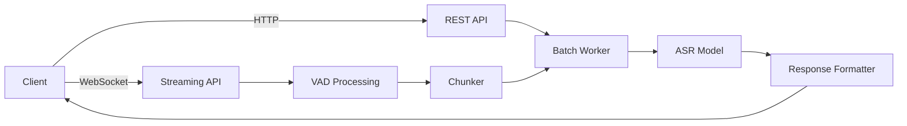

# Parakeet-TDT 0.6B v2 FastAPI STT Service

A production-ready FastAPI service for high-accuracy English speech-to-text using NVIDIA's Parakeet-TDT 0.6B v2 model. Implements both REST and WebSocket endpoints following the [OpenAI Audio API specification](https://platform.openai.com/docs/api-reference/audio) interface.

## Changes from Upstream

This fork includes several improvements to the WebSocket streaming pipeline:

- **In-memory audio pipeline** - VAD chunks are passed as numpy arrays with unique IDs instead of writing temporary WAV files to disk. Eliminates filesystem I/O during streaming.
- **Per-session result isolation** - Each WebSocket session tracks its own chunk IDs, preventing cross-session result leakage under concurrent load.
- **Thread-pooled inference** - ASR inference runs via `asyncio.to_thread()` so the event loop stays responsive during GPU work.
- **Word-level confidence scores** - NeMo's `return_hypotheses=True` and confidence decoding are enabled. WebSocket responses now include `confidence` and per-word `words` scores alongside `text`.
- **Configurable batch window** - New `BATCH_WINDOW_MS` env var (default 100ms) controls how long the micro-batcher waits to collect items before running inference. `BATCH_SIZE` default raised from 4 to 16.
- **Graceful session teardown** - Consumer tasks are properly cancelled and pending results are cleaned up when a WebSocket disconnects.

## Features

- **RESTful transcription**
  - `POST /transcribe` with multipart audio uploads
  - Word/character/segment timestamps
  - OpenAI-compatible response schema

- **WebSocket streaming**
  - Real-time voice activity detection via Silero VAD
  - Partial/final transcription delivery with confidence scores
  - Supports 16kHz mono PCM input
  - Per-session result isolation for safe concurrent use

- **Batch processing**
  - Micro-batching for efficient GPU utilization
  - Configurable batch size and batch window
  - Thread-pooled inference keeps the event loop responsive

- **Production-ready deployment**
  - Docker and Docker Compose support
  - Health check endpoint and non-root, air-gapped container
  - Optional API-key authentication
  - Configurable model/component sources (Artifactory-friendly)
  - Environment variable configuration

- **Audio preprocessing**
  - Automatic downmixing and resampling
  - File validation and chunking

## Table of Contents

- [Prerequisites](#prerequisites)
- [Installation](#installation)
- [Configuration](#configuration)
- [Model Sources (Artifactory / Air-Gapped)](#model-sources-artifactory--air-gapped)
- [Authentication](#authentication)
- [Running the Server](#running-the-server)
- [Usage](#usage)
  - [REST API](#rest-api)
  - [WebSocket Streaming](#websocket-streaming)
- [Benchmarking](#benchmarking)
- [Architecture Overview](#architecture-overview)
- [Environment Variables](#environment-variables)
- [Contributing](#contributing)

## Prerequisites

- Python 3.10+
- NVIDIA GPU with CUDA 12.1+ (recommended)
- Docker Engine 24.0+ (for container deployment)

## Installation

### Local Development
```bash
git clone https://github.com/your-repo/parakeet-fastapi.git
cd parakeet-fastapi

# Create and activate virtual environment
python -m venv .venv
source .venv/bin/activate

# Install dependencies
pip install -r requirements.txt
```

### Docker Deployment
```bash
docker build -t parakeet-stt .
docker run -d -p 8000:8000 --gpus all parakeet-stt
```

### Docker Compose
```bash
docker-compose up --build
```

## Configuration

All configuration is managed through environment variables. Create a `.env` file with your preferences:

```ini
# Model configuration
MODEL_PRECISION=fp16
DEVICE=cuda
BATCH_SIZE=16
BATCH_WINDOW_MS=100

# Audio processing
TARGET_SR=16000
MAX_AUDIO_DURATION=3600
VAD_THRESHOLD=0.5

# Security / DoS limits
API_KEY=                       # unset = open; set = required on all endpoints
MAX_UPLOAD_BYTES=104857600     # 100 MiB upload cap

# System
LOG_LEVEL=INFO
PROCESSING_TIMEOUT=60
```

See [`.env.example`](.env.example) for the full annotated list.

## Model Sources (Artifactory / Air-Gapped)

The ASR model and Silero VAD are **pre-baked into the image at build time** so the
runtime container is fully self-contained — it makes no calls to Hugging Face, NGC,
or GitHub at startup (`HF_HUB_OFFLINE=1` is enforced). Where those artifacts are
pulled *from* during the build is configurable, so you can source everything from
an internal Artifactory.

The ASR model source is controlled by `MODEL_SOURCE`, which accepts three forms.
The two Artifactory-friendly methods are documented below.

### Method 1 — Direct `.nemo` artifact (Artifactory generic repo)

Point `MODEL_SOURCE` at an `http(s)` URL of a `.nemo` file. It is downloaded once
into `MODEL_CACHE_DIR` and loaded via NeMo's `restore_from`. Supply an optional
bearer token for authenticated repos via a BuildKit secret (kept out of image
layers and history).

```bash
export MODEL_SOURCE_TOKEN="<artifactory-access-token>"

DOCKER_BUILDKIT=1 docker build \
  --secret id=model_source_token,env=MODEL_SOURCE_TOKEN \
  --build-arg MODEL_SOURCE=https://artifactory.example.com/artifactory/models/parakeet-tdt-0.6b-v2.nemo \
  --build-arg PIP_INDEX_URL=https://artifactory.example.com/artifactory/api/pypi/pypi-remote/simple \
  --build-arg TORCH_INDEX_URL=https://artifactory.example.com/artifactory/api/pypi/pytorch-remote/simple \
  -t parakeet-stt .
```

`MODEL_SOURCE` is baked into the image so the runtime resolves the same cached
artifact. A local `.nemo` path also works (`MODEL_SOURCE=/opt/models/asr/model.nemo`)
if you mount or copy the file in yourself.

### Method 2 — Hugging Face remote proxy (repo id + `HF_ENDPOINT`)

Keep `MODEL_SOURCE` as the repo id and route `from_pretrained` through an
Artifactory HuggingFace-remote repository by setting `HF_ENDPOINT`:

```bash
DOCKER_BUILDKIT=1 docker build \
  --build-arg MODEL_SOURCE=nvidia/parakeet-tdt-0.6b-v2 \
  --build-arg HF_ENDPOINT=https://artifactory.example.com/artifactory/api/huggingfaceml/hf-remote \
  --build-arg PIP_INDEX_URL=https://artifactory.example.com/artifactory/api/pypi/pypi-remote/simple \
  --build-arg TORCH_INDEX_URL=https://artifactory.example.com/artifactory/api/pypi/pytorch-remote/simple \
  -t parakeet-stt .
```

### Components (pip / torch wheels)

Independently of the model, redirect Python packages to Artifactory PyPI mirrors
with the `PIP_INDEX_URL` / `PIP_EXTRA_INDEX_URL` / `TORCH_INDEX_URL` build args
(shown above). These are **build-time only**.

### Silero VAD

Defaults to the `snakers4/silero-vad` torch.hub repo (cached at build). To load a
vendored copy from a directory instead, set `VAD_SOURCE_TYPE=local` and
`VAD_SOURCE=/path/to/vendored/silero-vad` (the directory must be present in the
image).

### `docker compose`

The same knobs are exposed as environment variables consumed by
`docker-compose.yaml` (both `build.args` and runtime `environment`):

```bash
export MODEL_SOURCE=https://artifactory.example.com/artifactory/models/parakeet-tdt-0.6b-v2.nemo
export PIP_INDEX_URL=https://artifactory.example.com/artifactory/api/pypi/pypi-remote/simple
export TORCH_INDEX_URL=https://artifactory.example.com/artifactory/api/pypi/pytorch-remote/simple
docker compose up --build -d
```

## Authentication

Authentication is **optional and off by default**. If `API_KEY` is unset or empty,
the service is open. If `API_KEY` is set, every REST request and WebSocket
connection must present the matching key; `/healthz` remains open for probes.

Clients present the key one of these ways:

```bash
# Header (default header name; override with API_KEY_HEADER)
curl -H "x-api-key: $API_KEY" ...
# or a bearer token
curl -H "Authorization: Bearer $API_KEY" ...
```

For the WebSocket, browser clients that cannot set headers may pass it as a query
parameter: `ws://host:8000/ws?api_key=<key>`. Invalid/missing keys receive `401`
(REST) or a `1008` policy-violation close (WebSocket).

> For the full hardening posture (container, supply chain, DoS limits, deployment
> assumptions) see [`SECURITY.md`](SECURITY.md).

## Running the Server

### Local Development
```bash
uvicorn parakeet_service.main:app --host 0.0.0.0 --port 8000
```

### Production
```bash
docker-compose up --build -d
```

## Usage

### REST API

#### Health Check
```bash
curl http://localhost:8000/healthz
# {"status":"ok"}
```

#### Transcription
```bash
curl -X POST http://localhost:8000/transcribe \
  -F file="@audio.wav" \
  -F include_timestamps=true \
  -F should_chunk=true
```

**Parameters**:
| Name | Type | Default | Description |
|------|------|---------|-------------|
| `file` | `audio/*` | Required | Audio file (wav, mp3, flac) |
| `include_timestamps` | bool | false | Return word/segment timestamps |
| `should_chunk` | bool | true | Enable audio chunking for long files |

**Response**:
```json
{
  "text": "Transcribed text content",
  "timestamps": {
    "words": [
      {"text": "Hello", "start": 0.2, "end": 0.5},
      {"text": "world", "start": 0.6, "end": 0.9}
    ],
    "segments": [
      {"text": "Hello world", "start": 0.2, "end": 0.9}
    ]
  }
}
```

### WebSocket Streaming

Connect to `ws://localhost:8000/ws` to stream audio:

- **Input**: 16kHz mono PCM frames (int16)
- **Output**: JSON messages with transcriptions and confidence scores

**Response format**:
```json
{"text": "hello world", "confidence": 0.9812, "words": [0.9934, 0.9691]}
```

**JavaScript Example**:
```javascript
const ws = new WebSocket("ws://localhost:8000/ws");
const audioContext = new AudioContext();
const processor = audioContext.createScriptProcessor(1024, 1, 1);

processor.onaudioprocess = e => {
  const pcmData = e.inputBuffer.getChannelData(0);
  const int16Data = convertFloat32ToInt16(pcmData);
  ws.send(int16Data);
};

ws.onmessage = evt => {
  const data = JSON.parse(evt.data);
  console.log("Transcription:", data.text);
  console.log("Confidence:", data.confidence);
};
```

## Live Demo Dashboard

The service serves a built-in demo page at the root URL (`GET /`) that captures
your microphone in the browser, streams it to the `/ws` endpoint, and renders the
transcription live.

```
http://localhost:8000/          # on the server itself
```

### HTTP by default; HTTPS is an opt-in toggle

The service runs **plain HTTP by default** — the intended mode for API access
in production, where a Kubernetes ingress (or other gateway) terminates TLS in
front of it. Leave things as-is for that deployment; no TLS config belongs in
the container.

**Microphone requires a secure context.** Browsers only allow mic capture over
`https://` or on `localhost`, so using the dashboard's mic *from another machine*
needs HTTPS. For one-off local demos, set the runtime env var `ENABLE_TLS=1` and
the container generates a self-signed cert at startup (written to tmpfs — nothing
is baked into the image):

```bash
# One-off demo with HTTPS + microphone over the LAN
docker run -d --name parakeet-demo \
  --gpus '"device=<uuid-or-index>"' \
  -e DEVICE=cuda -e ENABLE_TLS=1 \
  --read-only --tmpfs /tmp --cap-drop ALL --security-opt no-new-privileges \
  -p 8443:8000 parakeet-stt

# or with compose:  ENABLE_TLS=1 docker compose up
```

Then open `https://<server-ip>:8443/` and accept the self-signed certificate
warning once.

| Mode | Set | Serves | Use for |
|------|-----|--------|---------|
| **HTTP** (default) | `ENABLE_TLS` unset | `http://…` | API access; production behind an ingress that does TLS |
| **HTTPS** (opt-in) | `ENABLE_TLS=1` | `https://…` (self-signed) | One-off browser-mic demos over the LAN |

In Kubernetes, leave `ENABLE_TLS` unset in the Deployment and let the ingress
provide HTTPS. If an `API_KEY` is set, append it to the dashboard URL so the
WebSocket can authenticate: `…/?api_key=<key>`.

## Benchmarking

`benchmark_stt.py` is a realtime streaming concurrency benchmark for the STT service. It generates test audio via a TTS service, streams it over concurrent WebSocket connections at real-time pace, and measures EOS latency, word error rate (WER), GPU utilization, and VRAM usage as concurrency scales up.

### Prerequisites

All benchmark dependencies are included in `requirements.txt`:

```bash
pip install -r requirements.txt
```

You also need:
- A running **STT service** (this project) accessible via WebSocket
- A running **TTS service** (e.g. Chatterbox) to generate test audio on first run
- `nvidia-smi` on the benchmark host for GPU metrics (skipped gracefully if unavailable)

Generated audio is cached locally in `.benchmark_cache/` so the TTS service is only needed on the first run.

### Examples

```bash
# Diagnose connectivity — single verbose session showing every WebSocket message
python benchmark_stt.py --probe --stt-url ws://localhost:8000/ws

# Default benchmark — ramp concurrency 1 -> 5 -> 10 -> 20 -> 30 -> 40
python benchmark_stt.py --stt-url ws://localhost:8000/ws

# Custom concurrency levels with a specific TTS service and output file
python benchmark_stt.py \
  --stt-url ws://localhost:8000/ws \
  --tts-url http://localhost:8004/tts \
  --concurrency 1,10,20,50 \
  --output results.csv

# Verbose mode — print per-session send/receive details for every session
python benchmark_stt.py --stt-url ws://localhost:8000/ws --concurrency 1,5 -v

# Target a specific GPU for monitoring (instead of auto-detect)
python benchmark_stt.py --stt-url ws://localhost:8000/ws --gpu-id 3

# Stress test at high concurrency
python benchmark_stt.py \
  --stt-url ws://localhost:8000/ws \
  --concurrency 1,20,40,60,80,100
```

### Options

| Flag | Default | Description |
|------|---------|-------------|
| `--stt-url` | `ws://localhost:8000/ws` | WebSocket URL of the STT service |
| `--tts-url` | `http://localhost:8004/tts` | HTTP URL of the TTS service for generating test audio |
| `--concurrency` | `1,5,10,20,30,40` | Comma-separated concurrency levels to ramp through |
| `--output` | `benchmark_results.csv` | Output CSV file path |
| `--timeout` | `30.0` | Per-message receive timeout (seconds). Acts as a fallback; the receiver normally exits early once all results are in |
| `--post-wait` | `30.0` | Hard cap on how long to wait after all audio is sent (seconds) |
| `--gpu-id` | auto-detected | GPU device index for monitoring. Auto-detected from the process running the STT model |
| `--probe` | off | Run a single verbose diagnostic session, then exit |
| `--verbose`, `-v` | off | Print per-session frame/message details and timings during the benchmark |

### How It Works

1. **Audio generation** — The tool generates unique TTS audio for each concurrent session from a pool of reference paragraphs. Audio is cached in `.benchmark_cache/` as `.npz` files so subsequent runs skip TTS entirely.

2. **Real-time streaming** — Each session opens a WebSocket, streams 100ms PCM frames at wall-clock pace (simulating a live microphone), then sends 1 second of silence to flush the server's VAD.

3. **Smart early exit** — The receiver tracks `{"status": "queued"}` messages from the server (one per VAD chunk) and counts text results as they arrive. Once all audio has been sent and every queued chunk has a corresponding result, the session exits immediately instead of waiting for the full `--timeout` period.

4. **Word error rate** — Since audio is generated from known reference text, the tool computes WER by comparing the STT transcript against the original. An order-independent matching algorithm handles cases where batched inference returns chunks out of order.

5. **GPU monitoring** — `nvidia-smi dmon` runs in the background sampling utilization and VRAM at 1Hz. The benchmark auto-detects which GPU is running the parakeet process.

### Reported Metrics

| Metric | Description |
|--------|-------------|
| EOS Latency (p50/p95/mean) | Time from last audio frame sent to final transcript received. This is what a voice agent user feels as "waiting for the system to understand." |
| Audio Duration | Average length of the test speech clips (seconds) |
| WER% | Word error rate vs. the known reference text. Requires `jiwer` (`pip install jiwer`). Shows `n/a` if the library is missing |
| GPU% (p95/mean) | GPU SM utilization during the concurrency level (sampled at 1Hz) |
| VRAM (peak/mean) | GPU memory usage in MiB during the concurrency level |
| Fail | Number of sessions that received no transcription vs. total sessions |

### Sample Output

```
Conc   EOS p50  EOS p95  EOS mean  Audio Dur    WER%    Fail  GPU%p95 GPU%mean  VRAM peak VRAM mean
   1    0.2820   0.2820    0.2820      7.44s   0.00%     0/1       0%       0%   5169 MiB  5169 MiB
   5    0.3533   0.6436    0.4238      7.50s   1.95%     0/5      20%       4%   5169 MiB  5169 MiB
  10    0.4123   0.7799    0.4483      7.66s   2.85%    0/10      31%       7%   5169 MiB  5169 MiB
```

### Probe Mode

Use `--probe` for a single verbose session that prints every WebSocket message with timestamps. Useful for diagnosing connectivity issues, checking that the STT service returns results, and verifying VAD flush behavior.

```
$ python benchmark_stt.py --probe --stt-url ws://localhost:8000/ws

  Connecting to ws://localhost:8000/ws ...
  Connected. Streaming at realtime pace (wall-clock paced)...
  [  4.006s] #1 [status]: {'status': 'queued'}
  [  4.303s] #2 [TEXT]:   {'text': 'The quick brown fox jumps over the lazy dog...'}
  [  7.501s] Audio sent. Sending silence to flush VAD...
  [  7.506s] #3 [status]: {'status': 'queued'}
  [  7.780s] #4 [TEXT]:   {'text': 'She sells seashells by the seashore...'}
  [  8.501s] Silence sent. Waiting for results...
  [  8.501s] all 2 result(s) received — exiting early

  Probe complete in 8.50s. Messages received: 4
```

## Architecture Overview


```mermaid
graph LR
A[Client] -->|HTTP| B[REST API]
A -->|WebSocket| C[Streaming API]
B --> D[Batch Worker]
C --> E[VAD Processing]
E --> F[Chunker]
F --> D
D --> G[ASR Model]
G --> H[Response Formatter]
H --> A
```

**Components**:
1. **`main.py`** - App initialization and lifecycle management
2. **`routes.py`** - REST endpoints implementation
3. **`stream_routes.py`** - WebSocket endpoint handler with per-session isolation
4. **`streaming_vad.py`** - Voice activity detection (in-memory numpy pipeline)
5. **`chunker.py`** - Audio segmentation
6. **`batchworker.py`** - Micro-batch processing with thread-pooled inference
7. **`model.py`** - ASR model interface with confidence scoring
8. **`audio.py`** - Audio preprocessing utilities
9. **`config.py`** - Configuration management

## Environment Variables

| Variable | Default | Description |
|----------|---------|-------------|
| `MODEL_PRECISION` | fp16 | Model precision (fp16/fp32) |
| `DEVICE` | cuda | Computation device |
| `BATCH_SIZE` | 16 | Processing batch size |
| `BATCH_WINDOW_MS` | 100 | Micro-batch collection window in milliseconds |
| `TARGET_SR` | 16000 | Target sample rate |
| `MAX_AUDIO_DURATION` | 3600 | Max decoded audio length in seconds (hard ceiling) |
| `VAD_THRESHOLD` | 0.5 | Voice activity threshold |
| `LOG_LEVEL` | INFO | Logging verbosity |
| `PROCESSING_TIMEOUT` | 60 | ffmpeg/transcode timeout in seconds |
| **Security** | | |
| `API_KEY` | _(unset)_ | If set, required on all endpoints (see [Authentication](#authentication)) |
| `API_KEY_HEADER` | x-api-key | Header name clients use to send the key |
| `MAX_UPLOAD_BYTES` | 104857600 | Reject uploads larger than this (100 MiB) |
| **Model sources** | | |
| `MODEL_SOURCE` | nvidia/parakeet-tdt-0.6b-v2 | Repo id, local `.nemo` path, or `http(s)` URL to a `.nemo` |
| `MODEL_CACHE_DIR` | /opt/models/asr | Cache dir for downloaded `.nemo` artifacts |
| `MODEL_SOURCE_TOKEN` | _(unset)_ | Optional bearer token for the `MODEL_SOURCE` download |
| `HF_ENDPOINT` | _(unset)_ | Hugging Face endpoint override (Artifactory HF proxy) |
| `VAD_SOURCE` | snakers4/silero-vad | torch.hub repo id or vendored local dir |
| `VAD_SOURCE_TYPE` | github | `github` or `local` |

> Build-time only (docker build args): `PIP_INDEX_URL`, `PIP_EXTRA_INDEX_URL`,
> `TORCH_INDEX_URL` — see [Model Sources](#model-sources-artifactory--air-gapped).

## Contributing

1. Fork the repository and create your feature branch
2. Submit a pull request with detailed description
